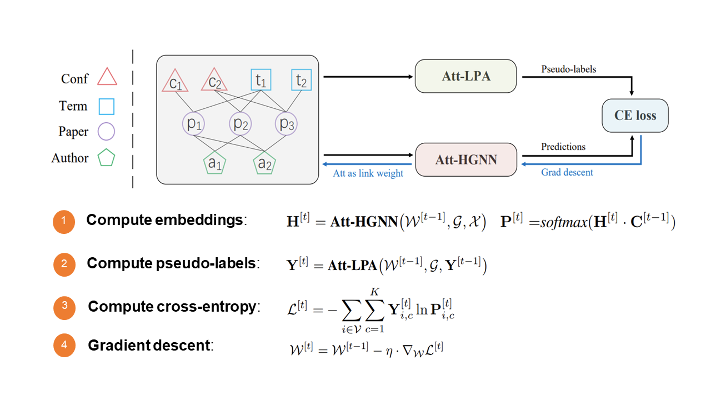

# SHGP
This repository contains the source code of our NeurIPS 2022 paper: "Self-supervised Heterogeneous Graph Pre-training based on Structural Clustering". 

See the paper at OpenReview: <https://openreview.net/forum?id=fBU4qsM6Fkf>.

## Datasets
The other preprocessed datasets are too large to be posted on GitHub. They can be downloaded from Baidu cloud drive: [https://pan.baidu.com/s/1_EemCZ4XOiIX07JemSTpaA?pwd=shgp](https://pan.baidu.com/s/1_EemCZ4XOiIX07JemSTpaA?pwd=shgp).

## Base Encoder
For the Att-HGNN module of SHGP, we adopt our previously proposed ie-HGCN as its base encoder. Please refer to our ie-HGCN repository: [https://github.com/kepsail/ie-HGCN](https://github.com/kepsail/ie-HGCN).

## Software

python == 3.8.8

scipy == 1.6.2

torch == 1.9.1

numpy == 1.20.1

scikit-learn == 0.24.1

## Hardware
GPU: GeForce GTX 1080 Ti

CPU: Intel(R) Xeon(R) CPU E5-2620 v4 @ 2.10GHz

## Usage
Go to ./code, and execute the following command:
> python main.py 
